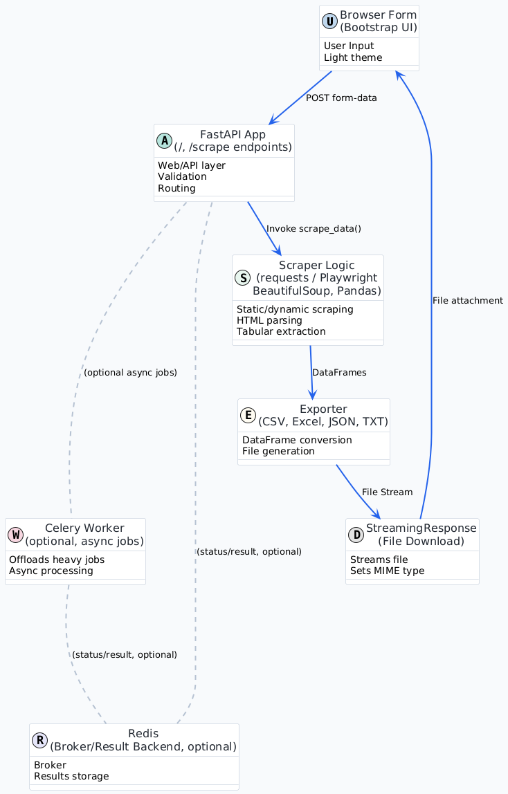

# 🕸️ Web Scraper & Data Collection Tool

A production-ready, browser-first web app to scrape static or dynamic web pages, extract tables or structured content via CSS selectors, paginate across pages, and export clean datasets in CSV, Excel (.xlsx), JSON, or TXT — all delivered as a direct download. Built with a pragmatic, extensible architecture using FastAPI, BeautifulSoup, Pandas, and optional Playwright + Celery.

<div align="center">


</div>

<p align="left">
  
  
  
  
  
  
  
  
  
  
  
  
</p>

---

## ✨ What you get (as a user)
- 🌐 Direct browser download — no job IDs or polling needed for the common path.
- 🔍 Targeted extraction with CSS selectors (tables or any elements).
- 🕹️ Dynamic rendering via Playwright for JS-heavy sites (optional).
- 🔄 Pagination support:
  - Query parameter iteration (e.g., `?page=1..N`)
  - Next-link navigation by CSS selector (e.g., a “Next” button)
- 📝 Export formats: CSV, Excel (multi-sheet for multi-table pages), JSON, TXT.
- 🎨 Clean, accessible UI (Bootstrap + custom light theme).

## 🧱 What you get (as a developer/architect)
- Clear layering: Presentation → API → Scraping → Export → Delivery.
- FastAPI endpoints with streaming responses and MIME-correct downloads.
- Pluggable scraping core: requests or Playwright → BeautifulSoup → Pandas.
- Optional async offloading with Celery + Redis for heavy workloads.
- Simple project structure with room for growth and testing.

---

## 🧭 Table of Contents
- [Overview](#overview)
- [Architecture](#architecture)
- [Data Flow](#data-flow-sequence)
- [API and Parameters](#api-and-parameters)
- [Extraction & Export Details](#extraction--export-details)
- [Getting Started](#getting-started-local)
- [Docker & Optional Async](#docker--optional-async)
- [Project Structure](#project-structure)
- [Usage Examples](#usage-examples)
- [Performance Tips](#performance-tips)
- [Security Notes](#security-notes)
- [Troubleshooting](#troubleshooting)
- [Roadmap](#roadmap-suggested)
- [Contributing](#contributing)
- [License](#license)


---

## 🗺️ Overview
This application lets users input:
- a target URL,
- an optional CSS selector,
- an output format,
- optional dynamic rendering and pagination controls,

then returns a clean dataset as a file download. For pages with multiple HTML tables, Excel exports contain one worksheet per table. For non-table selectors, the app returns structured rows with useful fields (e.g., tag, text, absolute href/src, attributes).

[Back to top](#web-scraper--data-collection-tool)

---

## 🏗️ Architecture

- Presentation: Bootstrap form submits `multipart/form-data` to `/scrape`, and receives a streamed file.
- API: FastAPI routes (`/`, `/scrape`) validate inputs and orchestrate scraping + export.
- Scraping: `requests` (static) or `playwright` (dynamic) → `BeautifulSoup` for parsing → Pandas DataFrame(s).
- Export: CSV/JSON/TXT; Excel uses multi-sheet when multiple tables exist.
- Delivery: StreamingResponse sets correct MIME type and Content-Disposition.
- Optional async: Celery workers with Redis broker/result backend to offload heavy scrapes.



[Back to top](#web-scraper--data-collection-tool)

---

## 🔄 Data Flow (sequence)


[Back to top](#web-scraper--data-collection-tool)

---

## 🔌 API and Parameters

- GET `/` → Renders the form UI.
- POST `/scrape` → Accepts `multipart/form-data` and returns a streamed file.

Form fields:
- url (string, required): Must start with http:// or https://
- selector (string, optional): CSS selector to target elements/tables
- format (string, required): one of csv | xlsx | json | txt
- dynamic (bool, optional): "on"/"true"/"1" to enable Playwright
- wait_selector (string, optional): CSS selector Playwright should wait for
- wait_ms (int, optional): Additional wait in milliseconds
- page_param (string, optional): Query parameter name for page iteration (e.g., "page")
- page_start (int, optional): Start page index
- page_end (int, optional): End page index (inclusive)
- next_selector (string, optional): CSS selector for a “Next” link/button to follow
- max_pages (int, optional): Safety cap for next-link pagination
- delay_ms (int, optional): Delay between paginated requests

Response:
- 200 OK: Streaming file with headers:
  - Content-Type: text/csv | application/vnd.openxmlformats-officedocument.spreadsheetml.sheet | application/json | text/plain
  - Content-Disposition: attachment; filename=scraped.<ext>
- 400/500: HTML error message with brief diagnostics.

Curl example:
```bash
curl -X POST http://127.0.0.1:8000/scrape \
  -F "url=https://en.wikipedia.org/wiki/List_of_countries_by_GDP_(nominal)" \
  -F "selector=table.wikitable" \
  -F "format=xlsx"
```

[Back to top](#web-scraper--data-collection-tool)

---

## 🧩 Extraction & Export Details

Tables:
- If the page or selector yields HTML tables, they are parsed into Pandas DataFrames.
- Excel export: multiple tables → multiple sheets (table_1, table_2, ...).

Non-table elements:
- When the selector targets non-table elements, rows include structured fields like:
  - tag, text, href (absolute if present), src (absolute if present), attributes (flattened/selected)
- Output renders cleanly across formats (CSV/JSON/TXT).

Dynamic rendering (optional):
- Enable when the page relies on JavaScript to populate content.
- Playwright launches headless Chromium, optionally:
  - waits for `wait_selector`
  - waits an additional `wait_ms` for stability
- Trade-offs: higher resource cost and latency vs. better completeness of content.

Pagination:
- Query parameter iteration: appends/replaces `?{page_param}={N}` for page_start..page_end.
- Next-link navigation: clicks/follows the anchor found by `next_selector` until not found or `max_pages` reached.
- Combine with `delay_ms` to be polite and avoid rate limits.

[Back to top](#web-scraper--data-collection-tool)

---

## 🚀 Getting Started (Local)

Requirements:
- Python 3.11+
- Optional (dynamic pages): Playwright Chromium

Install and run:
```bash
pip install -r requirements.txt
uvicorn app.main:app --host 127.0.0.1 --port 8000 --reload
```

Open http://127.0.0.1:8000

Playwright setup (optional, for dynamic pages):
```bash
python -m playwright install chromium
```

[Back to top](#web-scraper--data-collection-tool)

---

## 🐳 Docker & Optional Async

Run with Docker:
```bash
docker-compose up --build
```
Web: http://127.0.0.1:8000

Optional Celery worker:
```bash
docker-compose run --rm worker
```

Notes:
- Async mode is optional; the standard path streams results immediately.
- For very large, long-running scrapes, consider enabling Celery + Redis and extending `/status` and `/result` endpoints.

[Back to top](#web-scraper--data-collection-tool)

---

## 📂 Project Structure

```
app/
  main.py        # FastAPI app and static mount
  routes.py      # Endpoints: /, /scrape (+ placeholders for async status)
  utils.py       # Scraping logic and file generation
  models.py      # Pydantic models (reserved for future)
templates/
  index.html     # Bootstrap form UI
static/
  css/style.css  # Custom light theme
  js/app.js      # Minimal JS (if needed)
tests/           # Basic tests
assets/
  banner.svg     # README/branding asset
```

[Back to top](#web-scraper--data-collection-tool)

---

## 🧑‍🏫 Usage Examples

1) Extract a Wikipedia table to CSV
- URL: A “List of …” page with tables
- Selector: `table.wikitable`
- Format: CSV

2) Extract article paragraphs to TXT
- URL: Any article
- Selector: `article p`
- Format: TXT

3) Dynamic content list to JSON with wait
- Enable “Dynamic rendering”
- Wait selector: `.list, #content, table` (whichever fits)
- Format: JSON

4) Paginate via query param to XLSX
- page_param: `page`
- page_start: 1, page_end: 5
- Selector: `table`
- Format: XLSX (will group multiple tables/pages)

[Back to top](#web-scraper--data-collection-tool)

---

## ⚙️ Performance Tips

- Provide specific CSS selectors (e.g., `table.data`, `.product-list > .item`) to reduce parsing overhead.
- Prefer `requests` unless the site is JS-heavy — toggle Playwright only when necessary.
- Use `page_end` or `max_pages` to prevent deep crawls.
- Add `delay_ms` for throttling to avoid bans or rate limits.
- Consider offloading heavy jobs to Celery workers in production.

[Back to top](#web-scraper--data-collection-tool)

---

## 🔒 Security Notes

- Only http/https URLs are accepted.
- Respect robots.txt, site ToS, and legal constraints for scraping.
- Consider production hardening:
  - Rate limiting, timeouts, and retries policies
  - CSP and security headers
  - Input validation and URL allowlist per your org policy
  - Network egress rules for scraper containers

[Back to top](#web-scraper--data-collection-tool)

---

## 🧩 Troubleshooting

- Empty CSV/Excel
  - Enable dynamic rendering and provide a `wait_selector` (e.g., `table`, `#content`).
  - Some sites block bots — adjust User-Agent or add `delay_ms`.
- No download
  - Ensure a format is selected and URL starts with http/https.
- Playwright errors
  - Install Chromium: `python -m playwright install chromium`

[Back to top](#web-scraper--data-collection-tool)

---

## 🗺️ Roadmap (suggested)
- Add configurable headers, proxies, and per-site profiles.
- Enrich non-table extraction with configurable attribute whitelists.
- Add auth patterns (cookies/session/headers) for private data (where allowed).
- Production-grade Celery integration with persistent storage for results.
- Advanced pagination heuristics (auto-detect next links).

[Back to top](#web-scraper--data-collection-tool)

---

## 🤝 Contributing
- Open issues and PRs are welcome. Please:
  - Keep changes focused and tested.
  - Describe the behavior clearly and link any relevant pages for reproducibility.

[Back to top](#web-scraper--data-collection-tool)

---

## 📜 License
MIT © 2025 Youssef Chlih

[Back to top](#web-scraper--data-collection-tool)
